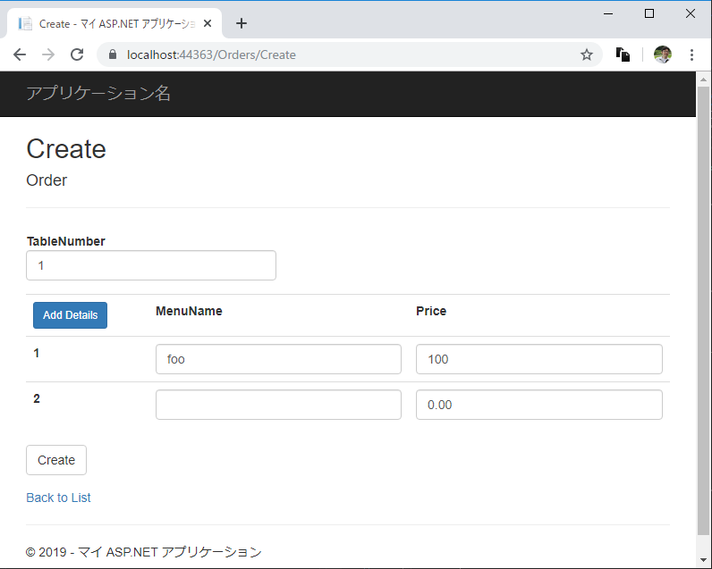

# ASP.NET MVCにおいて親子関係のあるモデルを扱う

## はじめに

ASP.NET MVC5 において、注文とその明細のような 1:N の親子関係のあるモデルを扱う際に、明細行を一括で追加/更新するような場合の実装方法について解説します。

今回はレストランの注文を管理するシステムをイメージしてサンプルを作成していきます。



完成品は以下で公開しています。

[Kazunori-Kimura/aspnet-order-management: ASP.NET MVC Modelの親子関係のサンプル](https://github.com/Kazunori-Kimura/aspnet-order-management)

## Modelクラス

扱うデータは `Order (注文)` クラスと `Detail (明細)` クラスに格納します。
ひとつの注文に複数の明細が紐づきます。

```cs:Order.cs
using System;
using System.Collections.Generic;

namespace OrderManagement.Models
{
    public class Order
    {
        public int Id { get; set; }
        public DateTime OrderDate { get; set; }
        public int TableNumber { get; set; }
        public virtual IList<Detail> Details { get; set; }
    }
}
```

```cs:Detail.cs
namespace OrderManagement.Models
{
    public class Detail
    {
        public int Id { get; set; }
        public string MenuName { get; set; }
        public decimal Price { get; set; }
        public int OrderId { get; set; }
        public virtual Order Order { get; set; }
    }
}
```

## OrdersController / Views

明細行をJavaScriptで追加すると `EditorFor` などの Htmlヘルパーの恩恵が受けられないので、サーバーサイドで明細行の追加を行うようにします。

### Create

`Create` の `GET` に対応するアクションメソッドにおいて、初期表示する明細行の行数を `ViewBag` に格納します。

```cs:OrdersController.cs

// GET: Orders/Create
public ActionResult Create()
{
    // 明細行の行数
    ViewBag.DetailsCount = 1;
    return View();
}

```

View側のポイントは2点です。

まず、`ViewBag` に格納された行数だけ明細行が表示されるように `for` ループを回します。 このときに `model.Details[i].MenuName` のように添え字をつけて `EditorFor` に渡すことがポイントです。
こうすることで `POST` の際に `Details` に入力値がバインドされます。

もうひとつ、`submit` した際に明細追加ボタンと作成ボタンのどちらがクリックされたかを判別するために各submitボタンに `name` を設定します。

```html:Create.cshtml
@using OrderManagement.Models
@model OrderManagement.Models.Order

@{
    ViewBag.Title = "Create";
}

<h2>Create</h2>


@using (Html.BeginForm())
{
    @Html.AntiForgeryToken()

    <div class="form-horizontal">
        <h4>Order</h4>
        <hr />
        @Html.ValidationSummary(true, "", new { @class = "text-danger" })
        
        <div class="form-group">
            @Html.LabelFor(model => model.TableNumber, htmlAttributes: new { @class = "control-label col-md-2" })
            <div class="col-md-10">
                @Html.EditorFor(model => model.TableNumber, new { htmlAttributes = new { @class = "form-control" } })
                @Html.ValidationMessageFor(model => model.TableNumber, "", new { @class = "text-danger" })
            </div>
        </div>

        @{
            var detail = new Detail();
        }
        <table class="table">
            <tr>
                <th>
                    @* 明細行の追加ボタン *@
                    <input type="submit" name="submit" value="Add Details" class="btn btn-primary btn-sm" />
                    @* 明細行数 *@
                    <input type="hidden" name="detailsCount" value="@ViewBag.DetailsCount" />
                </th>
                <th>
                    @Html.DisplayNameFor(model => detail.MenuName)
                </th>
                <th>
                    @Html.DisplayNameFor(model => detail.Price)
                </th>
            </tr>
            @* 明細の入力欄 *@
            @for (var i = 0; i < ViewBag.DetailsCount; i++)
            {
                <tr>
                    <th>@Html.Raw(i + 1)</th>
                    <td>
                        @Html.EditorFor(model => model.Details[i].MenuName, new { htmlAttributes = new { @class = "form-control" } })
                        @Html.ValidationMessageFor(model => model.Details[i].MenuName, "", new { @class = "text-danger" })
                    </td>
                    <td>
                        @Html.EditorFor(model => model.Details[i].Price, new { htmlAttributes = new { @class = "form-control" } })
                        @Html.ValidationMessageFor(model => model.Details[i].MenuName, "", new { @class = "text-danger" })
                    </td>
                </tr>
            }
        </table>

        <div class="form-group">
            <div class="col-md-offset-2 col-md-10">
                @* controller側でクリックされたボタンを判別するためにname=submitを追加 *@
                <input type="submit" name="submit" value="Create" class="btn btn-default" />
            </div>
        </div>
    </div>
}

<div>
    @Html.ActionLink("Back to List", "Index")
</div>

@section Scripts {
    @Scripts.Render("~/bundles/jqueryval")
}
```

つづいて、POSTされた際のアクションメソッドを実装します。

`Bind` に `Details` を追加します。
また、クリックされたボタンを判別するための `submit`、現在の明細行数を格納する `detailsCount` を引数に追加します。

`submit` にはクリックされたボタンの `value` が格納されているので、その値を見て明細行の追加かデータの保存処理かを判断します。

```cs:OrdersController.cs
// POST: Orders/Create
// 過多ポスティング攻撃を防止するには、バインド先とする特定のプロパティを有効にしてください。
// 詳細については、https://go.microsoft.com/fwlink/?LinkId=317598 を参照してください。
[HttpPost]
[ValidateAntiForgeryToken]
public ActionResult Create([Bind(Include = "Id,OrderDate,TableNumber,Details")] Order order, string submit, int detailsCount)
{
    // submitには押されたボタンのvalueが、
    // detailsCountにはhiddenに格納された明細行数が格納されます

    if (submit == "Add Details")
    {
        // 明細追加が押された
        ViewBag.DetailsCount = detailsCount + 1;
        order.Details.Add(new Detail());
        return View(order);
    }

    if (ModelState.IsValid)
    {
        order.OrderDate = DateTime.Now;

        db.Orders.Add(order);
        db.SaveChanges();
        return RedirectToAction("Index");
    }

    return View(order);
}
```

### Edit

`Edit` でも考え方は同じです。

リストの添え字を元にバインドが行われるので、 `foreach` でなく `for` でループを回します。

POST時に `Id` や `OrderId` がきちんと保持されるように `HiddenFor` で隠しフィールドに格納しておきます。

```html:Edit.cshtml
@using OrderManagement.Models
@model OrderManagement.Models.Order

@{
    ViewBag.Title = "Edit";
}

<h2>Edit</h2>

@using (Html.BeginForm())
{
    @Html.AntiForgeryToken()

    <div class="form-horizontal">
        <h4>Order</h4>
        <hr />
        @Html.ValidationSummary(true, "", new { @class = "text-danger" })
        @Html.HiddenFor(model => model.Id)

        <div class="form-group">
            @Html.LabelFor(model => model.OrderDate, htmlAttributes: new { @class = "control-label col-md-2" })
            <div class="col-md-10">
                @Html.EditorFor(model => model.OrderDate, new { htmlAttributes = new { @class = "form-control" } })
                @Html.ValidationMessageFor(model => model.OrderDate, "", new { @class = "text-danger" })
            </div>
        </div>

        <div class="form-group">
            @Html.LabelFor(model => model.TableNumber, htmlAttributes: new { @class = "control-label col-md-2" })
            <div class="col-md-10">
                @Html.EditorFor(model => model.TableNumber, new { htmlAttributes = new { @class = "form-control" } })
                @Html.ValidationMessageFor(model => model.TableNumber, "", new { @class = "text-danger" })
            </div>
        </div>

        @{
            var detail = new Detail();
        }
        <table class="table">
            <tr>
                <th>
                    @* 明細行の追加ボタン *@
                    <input type="submit" name="submit" value="Add Details" class="btn btn-primary btn-sm" />
                </th>
                <th>
                    @Html.DisplayNameFor(model => detail.MenuName)
                </th>
                <th>
                    @Html.DisplayNameFor(model => detail.Price)
                </th>
            </tr>
            @* 登録済みの明細 *@
            @for (var index = 0; index < Model.Details.Count; index++)
            {
                <tr>
                    <th>
                        @Html.Raw(index + 1)
                        @Html.HiddenFor(model => model.Details[index].Id)
                        @Html.HiddenFor(model => model.Details[index].OrderId)
                    </th>
                    <td>
                        @Html.EditorFor(model => model.Details[index].MenuName, new { htmlAttributes = new { @class = "form-control" } })
                        @Html.ValidationMessageFor(model => model.Details[index].MenuName, "", new { @class = "text-danger" })
                    </td>
                    <td>
                        @Html.EditorFor(model => model.Details[index].Price, new { htmlAttributes = new { @class = "form-control" } })
                        @Html.ValidationMessageFor(model => model.Details[index].MenuName, "", new { @class = "text-danger" })
                    </td>
                </tr>
            }
        </table>

        <div class="form-group">
            <div class="col-md-offset-2 col-md-10">
                <input type="submit" value="Save" class="btn btn-default" />
            </div>
        </div>
    </div>
}

<div>
    @Html.ActionLink("Back to List", "Index")
</div>

@section Scripts {
    @Scripts.Render("~/bundles/jqueryval")
}
```

POST時のアクションメソッドのポイントは以下になります。

明細追加時に `Order` との関連付けを行うため、新しく生成した `Detail` の `OrderId` に 親となる `Order` の `Id` を保持します。

データベース反映時は、まず新しく追加された `Detail` をContextに反映してから、更新処理を行います。

```cs:OrdersController.cs
// POST: Orders/Edit/5
// 過多ポスティング攻撃を防止するには、バインド先とする特定のプロパティを有効にしてください。
// 詳細については、https://go.microsoft.com/fwlink/?LinkId=317598 を参照してください。
[HttpPost]
[ValidateAntiForgeryToken]
public ActionResult Edit([Bind(Include = "Id,OrderDate,TableNumber,Details")] Order order, string submit)
{
    // submitには押されたボタンのvalueが格納されます

    if (submit == "Add Details")
    {
        // 明細追加が押された
        order.Details.Add(new Detail() { OrderId = order.Id });
        return View(order);
    }

    if (ModelState.IsValid)
    {
        var list = order.Details.Where(item => item.Id == 0).ToList();
        foreach (var item in list)
        {
            db.Details.Add(item);
        }

        db.Entry(order).State = EntityState.Modified;
        db.SaveChanges();
        return RedirectToAction("Index");
    }
    return View(order);
}
```

### Delete

`Order` を削除する前に、紐づく `Detail` をすべて削除します。

```cs:OrderController.cs
// POST: Orders/Delete/5
[HttpPost, ActionName("Delete")]
[ValidateAntiForgeryToken]
public ActionResult DeleteConfirmed(int id)
{
    Order order = db.Orders.Find(id);

    db.Details.RemoveRange(order.Details);

    db.Orders.Remove(order);
    db.SaveChanges();
    return RedirectToAction("Index");
}
```

---

## 参考

- C# - ASP.NET MVC ViewからControllerへModelのListを渡す方法｜teratail (https://teratail.com/questions/108790)
- ASP.NET モデルバインディング - Qiita (https://qiita.com/kazuhisam3/items/94542f6d7ccf3acca41c)
